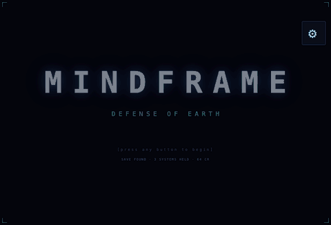

# Mindframe — Defense of System 001

A single-file browser space shooter set in the world of **"Mindframe"** by Oscar Moran.
You are the last human pilot. Four systems, five waves each — and every system
you take stays taken. You fly one system at a time: pick it off the chart, hold
it, and the result screen hands you back to the chart to choose again. Fall in
one and you lose that system, never the campaign.

**[Play it](index.html)** — no install, no build step, no server. Open `index.html` in any browser.



*Above: 35 seconds of the real thing — captured by running a bot through the
game's own `update()` and `draw()`, not reconstructed. `mindframe-cover.gif` is
a shorter 480px cut that fits itch.io's 3MB cover limit.*

## Controls

| Input | Action |
|---|---|
| `W` `A` `S` `D` | Thrust (momentum + drag) |
| Mouse | Aim |
| Click / `Space` | Fire |
| `Shift` | Blink dash *(requires the Blink Drive skill)* |
| `P` | Pause menu — **in Pilot School it leaves the school**, which is the only way out |
| `Esc` | Back one screen (and pauses a run); closes the gear first; does nothing in a drill |
| `Enter` | Presses the main button on the current screen |

## The title card

The first screen the game shows: the mark, a rule, and a prompt, over the live
starfield. It holds until you touch anything, then opens the menu. A save that
has held ground reads its own line under the prompt — systems held and credits
banked.

**A new pilot always sees the menu first, and then Pilot School opens itself**
a beat later. They get the wordmark and the live feed before anything asks them
to choose, which is the part that draws them in.

It fires **exactly once**, on the flag `save.schoolAuto`, which is set the moment
it triggers rather than when the school is finished. Gating it on completion
would mean a player who quit a drill got thrown straight back in every time they
reached the menu, with no way out. A wipe clears the flag, so a wiped save gets
the first run back.

## The cold open

**LAUNCH** does not drop you into a briefing. The defence net comes up first: a
grid unfolds from the horizon, two scan bars sweep the field, your actual hull
draws itself inside closing target rings, and a boot log reads back the save it
has been handed — hull, nodes owned, integrity and systems inbound.

It runs 6.2 seconds over the live starfield, under scanlines and a vignette, and
**any key or click skips it**. It is authored in `cineDraw()` as one timeline of
`t`-gated beats, so re-timing it is editing numbers, not code.

## Pilot School

A coached tutorial the menu opens for you on a first run, and that you can
return to from the menu any time. You fly; the caption panel teaches. Each lesson only clears
when you actually do the thing:

1. **Thrust** — fly through four markers, learning momentum and drag
2. **Aim and fire** — destroy four inert practice drones
3. **Hull** — survive fifteen seconds under fire
4. **Engage** — clear a live Iteration and two Watchers
5. **Supply** — collect three powerup cells

**SKIP LESSON** moves you straight to the next drill. It counts the lesson as
flown, so skipping does not leave the title screen nagging you about it.

**LESSONS** sits above it and opens the lesson select: every drill this save has
unlocked, listed with its state (`FLYING NOW` / `FLOWN` / `READY`), any of which
can be flown immediately. The order only ever mattered the first time through —
a pilot who wants the Repair Field drill again should not have to sit through
Thrust to reach it.

There is exactly one way out of a drill: **`P`**. It leaves the school outright.
`ESC` does nothing inside one and `P` does not open the pause menu there, so the
school cannot be quit three different ways by accident.

When you buy a skill that has a lesson, the menu's **PILOT SCHOOL**
button lights up with a count of new drills waiting, and clears once you have
flown them.

Extra lessons appear for the tier-3 skills you own — **Blink Drive**, **Triple
Spread**, **Phase Rounds**, **Repair Field** — so the school grows with the save.
Two of those drill the skill rather than demonstrate it, against **emplacements**:
Primaries bolted to the floor that still lead and fire, but never close.

- **Blink Drive** puts three *indestructible* emplacements on the right of the
  arena and asks for four **clean breaks**. A blink only counts if there was a
  round within 200px genuinely pointed at you when you pressed `SHIFT` — blinking
  into empty space says `NOTHING WAS COMING` and scores nothing. So the drill
  teaches the timing, not the button.
- **Repair Field** is an attrition drill. You start at 60% hull against three
  200-hull emplacements that between them out-damage the field, and you have to
  kill all three **without ever dropping under 25%**. Dropping under re-racks the
  whole drill with `PULL BACK SOONER`. The only way through is the loop the skill
  exists for: hit a target, break off before it costs more than you regain, come
  back full. The far-left corner is out of everything's range on purpose.

Nothing dies in the simulator: hitting zero hull just restores it. It scores
nothing and earns no points, and leaving early (**`P`**) does not count as
finishing, so it will open again next time. **PILOT SCHOOL**
on the menu replays it. The completion flag is local to the browser and
is not carried in save codes.

## The live feed

The home screen shows the game rather than describing it. The right-hand panel
plays **a recording of the real thing**: a bot flew System 001, driven through
the game's own `update()` with the real inputs, and the flight was captured at
20fps — player, hostiles, rounds, all of it. Playback draws those frames with the
same `unitPath()`, `shipPath()` and `ecol()` the arena draws with, so the feed
**cannot drift from the game**. It is not a mock-up that has to be kept in sync;
it is the game's own output.

What is embedded is the densest 28 seconds of that flight. Across the whole run
43% of frames have nothing on the field — hostiles spawn outside the arena and
take seconds to close — and a feed that is empty half the time shows nobody
anything. The chosen window is 18%.

It fits the **whole arena**, with no following camera. That was tried and
measured: at any zoom tight enough to make the hull read, most of the fight is
off the panel.

| zoom | hostiles on camera |
|---|---|
| 1.00 (full arena) | 65% |
| 1.30 | 41% |
| 1.50 | 27% |
| 2.05 | 5% |

So the panel is shaped to the arena (`1000/680`) instead of 4:3, which removes
the letterboxing and buys back the size that not zooming costs.

To re-record after the game changes: replay a bot, re-encode, replace
`FEED_DATA`. Nothing else in the playback needs touching.

## The gear

One cluster of everything that is not the game, in the **same corner of every
screen** so it is never somewhere new: volume, **QUIT LEVEL** (shown only while
a level is running), the **bestiary**, **save codes**, and the **wipe**.

It remembers the screen it was opened over, so backing out of the bestiary or
the save code returns you there rather than dumping you at the menu. `ESC`
closes the gear before it does anything else.

## The world map

**LAUNCH** opens the campaign as a route rather than dropping you straight into
System 001. It reads bottom to top like the skill tree — 001 on the floor, the
Ruler's system at the ceiling.

It is a **level select**. Clearing a system holds it for good, and from then on
you can launch straight back into it — the climb is the first time through, not
every time. Systems 002 and 003 carry a dashed side branch; 003 also carries the
**Quantum Portal** on the opposite side. 001 and 004 carry nothing, and draw
nothing.

Click any node you have opened to move the launch cursor onto it; **LAUNCH**
names whichever system the cursor is on, and the map opens with the cursor
already on the furthest thing you are cleared to fly.

Every system node carries its **name and state and nothing else**. The numbers
that used to sit on the card — threat, credits a wave, the hostile it adds —
live on the launching screen now, which is the screen that exists to carry them.
A route you are choosing from wants to be readable at a glance; a flight you have
chosen wants the detail.

The chart is a live readout rather than a static diagram, all on a canvas driven
by the main loop:

- **A starfield** under everything: 210 stars in three parallax layers drifting
  at different rates, placed off a fixed pseudo-random seed so they hold still
  between rebuilds rather than reshuffling every frame. The chart is a map of
  space, so the ground under it reads as sky rather than as a panel. No planets.
- **Three nebula clouds** drifting behind the grid, green through blue to
  violet, so the field has depth rather than being a flat panel.
- **The spine is a conduit**, not a line: a gradient core, a bright inner
  filament and rungs every twenty pixels, so it reads as built.
- **The Icarus**, beside the last system — the enemy battleship the route ends
  at, drawn as a long violet wedge with rib detail, a blinking command block and
  an engine wash trailing behind it. It occupies the space that system's side
  branch used to, which is otherwise dead now.
- **A station ring at every system** — two dashed rings counter-rotating, bright
  green on what you hold, blue and breathing on the one you are about to fly.
- **Charge climbing** the part of the route you already hold.
- **The Portal**, drawn as a turning seven-lobed vortex with rings collapsing
  into it — slow and dim while dormant, fast and lit when it is open to you.
- Corner brackets, scanlines and a scan bar over all of it.

Everything on the canvas is sized to **halo the info cards rather than sit
behind them** — the station rings start outside the card's corner radius, the
vortex lobes ride outside the portal card, and the ship marker sits clear of the
node's left edge. The cards themselves were narrowed (19% → 16%, branches 14% →
12%) to give the art the room. Nothing important is drawn where a card will
cover it.

Everything positional reads the same `MAP_X` / `MAP_Y` percentages the nodes are
placed with, so the canvas can never drift out of sync with the chart.

### The loadout floor

Reaching a system unlocks it; flying it for the first time still asks for a bare
minimum of skill tree. The launching screen names the number it expects
— 001 asks for nothing, then **6 CR**, **16 CR**, **32 CR**. Miss it and
**LAUNCH** reads `NEEDS 32 CR INVESTED — SYSTEM 004` and will not fire.

It is credits *invested in the tree*, not credits banked, so buying a skill is
what opens the next system. A **RESPEC** therefore closes the frontier node until you
re-spend, but it can never strand you: anything already `HELD` ignores the floor
entirely.

### Level complete

**Clearing a system is where the flight ends.** It does not roll into the next
one. You get a result screen — credits earned this flight, credits banked, score,
best — and then the chart, where you choose again. The last system reads
`CAMPAIGN COMPLETE` rather than `LEVEL COMPLETE`. `SYS_CLEAR_TEXT` holds a line
of your own per system for it.

That is the whole shape of the game now: pick one thing off the chart, fly it,
bank it, choose again.

## The launching screen

Between picking something on the map and flying it, one screen: what you are
about to fly, in numbers. It answers the question the map deliberately no longer
answers on its cards.

```
                     LAUNCHING
                    SYSTEM 004

          ENEMY FORCES
          THREAT ············· ×2.15
          NEW HOSTILE ········ SPLINTER
          BOSS ··············· THE RULER
          PAYOUT ············· +48 CR

          «your line for this system»

              ENGAGE      BACK — ESC
```

One panel, label-to-value rows with dotted leaders. A red `NEEDS 32 CR INVESTED`
row appears only when your tree is short of the system's loadout floor. Branches
get the same screen, and because their two descriptive rows carry sentences
rather than figures, those two stack — label above text, no leader.

Under the readout is a line of your own per system and per branch, held in
`LAUNCH_TEXT`. There is no **SKILL TREE** button here: the tree is a place you go
to spend, not something to open with a hand on the throttle. **BACK** returns to
the chart.

**ENGAGE** flies it. There is no story briefing in between — the cold open hands
straight to the first wave.

## Secret Missions

The side branches off the world map. When the map comes up between systems, the
branch beside the system you are about to fly lights up in yellow and you choose:
**CONTINUE** up the spine, or take the detour. One offer per system per run.

A salvage or escort run pays half again what a system pays — 42 credits off
System 002, 57 off 003. The Quantum Portal pays three and a half times:
**133 credits**.

**Failing one costs you the branch, not the campaign.** You lose the payout and
the second attempt at that branch, take a hull floor of 25%, and carry straight
on to the next system's briefing. The detour is a detour.

Branches are also **launch targets in their own right**. On the title map, click
one to put the launch cursor on it and **LAUNCH** flies it as a single sortie —
one mission, paid the same, and then straight back to the chart. That is what
makes a branch worth owning a tier for on a save that has already held every
system. Mid-run they behave as they always did: an offer on the map beside the
system you are about to fly.

Which branch you get is fixed by where you are on the route: **002 is Salvage,
003 is Escort**. System 001 has none and neither does 004 — a node on the map
you can never reach is just a dead label, so those systems simply do not draw
one.

The two off-roster bosses are not a side branch at all. They are behind the
**Quantum Portal**, which hangs off System 003 on the *other* side of the spine
— the only violet thing on the chart, drawn as a turning vortex rather than a
box. It pays **133 credits**, three and a half times what a system pays, and it is
what a system pays.

### A branch is something you grow into

Every branch is **named from the first time you see it** — `SECRET MISSION ·
ESCORT`, `QUANTUM PORTAL · DESTINATION UNKNOWN`. You know what you are flying
into and what it pays; the only open question is whether your loadout is up to
it. What gates a branch is the **tier of skill tree you own**:

| Branch | Opens once you own |
|---|---|
| **Salvage** (002) | any **tier-1** skill |
| **Escort** (003) | any **tier-2** skill |
| **Quantum Portal** (003) | any **tier-3** skill |

Until then the node on the chart reads `NEEDS A TIER 2 SKILL` and cannot be
taken. Once the tier is yours it reads `OFFERED AT 003` — naming the system it
hangs off, because a branch is only ever takeable on the map *between* systems,
where it lights yellow and becomes clickable. The Portal's tier-3 gate is
doing real work — what is through it is harder than anything on the route.

003 therefore offers a choice rather than an offer: Escort on the right, the
Portal on the left, one detour per system. Taking either forfeits the other.

| | Mission | What it is |
|---|---|---|
| 🟡 | **Escort** | A yellow hauler crawls across the field on a 44-second run with 340 hull of its own. **Everything out there hunts the hauler, not you** — the whole enemy AI retargets, so you are the only thing between them and it. It is a stream, not a trickle: `11 + system×4` scheduled hostiles with Watchers arriving in pairs, plus Trackers, Overseers and Splinters as the systems allow, plus **two timed pushes** at a third and two thirds of the crossing. Escort is also the only place the arena runs **12 live hostiles instead of ten**. What reaches it hurts: a Watcher ram is 40, a Primary 34, anything else 24, and stray fire lands at 1.6×. |
| 🟢 | **Salvage** | An open debris field with green credit motes scattered through it. No hostiles and **no clock** — just wreckage that costs **34 hull** and a hard shove on contact. It opens at `17 + system×5` pieces, gains another every **1.1 seconds**, and everything already out there accelerates on a `1 + t/17` ramp — up to **76 pieces at 3.4× drift**, where it levels off. Each mote is **1 credit, banked the moment you touch it**. The `EXIT` gate is open the whole time and nothing ever forces you through it: you leave when you decide another mote is not worth the field you would have to cross to reach it. |
| 🟪 | **Quantum Portal** | Nothing to collect and no clock — just the fight, through the vortex beside System 003. One of two bosses, picked at random each time you go through. |

Salvage is press-your-luck: what you have already picked up is yours even if the
wreck kills you, and nothing but your own judgement ends it — greed is the only
clock. Escort pays nothing at all unless the hauler makes it. Clearing
either patches you up by 15% and drops you into the next system's briefing.

### The two off the roster

The Portal puts you in front of one of these, chosen fresh every time you go
through it. Both use the same three-tier escalation as the campaign bosses — nothing
they do is untelegraphed, there is just more of it and it comes faster.

| | Name | What it is |
|---|---|---|
| 🟩 | **Iteration 3295** | The Watcher that held the record before 3296. Very fast, very close, and it will not hold still: scattered fire, telegraphed rams, blinking, and it throws Splinters at you. Three nested darts, drawn in pale green. **Pitched at a BULWARK pilot carrying every tier-1 and tier-2 skill** — about a fifth harder than the Ruler for that build, and a real fight for it. |
| 🟪 | **The Archive** | The Mindframe Upgrading Facility's core — a ring of stored minds around an empty middle. Shielded by an arc you have to keep flanking, and it rakes the arena and summons Overseers. **This is the game's Emerald Weapon.** 9,000 base hull, **four** tiers where everything else has three, seven `STORED MIND`s that come back **in full at every tier**, and rest windows about half a campaign boss's. A pilot who has bought the entire tree and flies the VERDICT still has a wall in front of them; anyone else should not be through the Portal at all. |

## Credits

Runs pay in **credits**, and credits are the only currency.

| | |
|---|---|
| Holding a wave | **2** credits in System 001, **4** in 002, **6** in 003, **8** in 004 |
| Killing a system's boss | **8** credits |
| Escort or Salvage | half again the system's total — 42 / 57 |
| The Quantum Portal | three and a half times — 133 |

A full clean run of all four systems is **132 credits**. Score is purely the
scoreboard — it earns nothing. Spend credits two ways, both directly:

- **Skills** — the tree charges credits, at **twice a skill's tier weight**: a
  4-weight tier-1 node is 8 CR, and the tier-3 nodes run 24 to 50. There is no
  second currency and no exchange; **RESPEC** refunds credits.
- **Hulls** — the Garage charges credits too.

Nothing in Pilot School pays; it is a simulator.

## Powerups

Wrecks drop cells. They drift, and once you are inside 150px they are yanked
hard toward you — a shorter reach than before, and a much stronger pull, so
collecting one is a deliberate move rather than something that happens near you.
They burn out
after about fourteen seconds — the last few seconds blink as a warning.

| | Cell | Effect |
|---|---|---|
| 🟢 | **Hull Repair** | Instantly restores 30% of your hull. Only drops when you are below 80%. |
| 🔵 | **Overclock** | Fire rate nearly doubled for 11s. |
| 🔴 | **Overcharge** | 1.8× damage for 11s — rounds turn red. |
| 🩵 | **Barrier** | 6.5s of complete immunity, shown as a ring around the ship. |
| 🟠 | **Scatter** | A temporary 3-shot spread for 12s, even without the skill. |

Heavier enemies drop more often (a Primary about half the time, a boss always
drops three). Active cells show as timer bars under your hull readout.

## Aim assist

A round that is going to miss narrowly leans into the target instead. It only
bends toward an enemy within 95px that is *ahead* of it and inside 0.8 radians
of the way it is already going, at up to 5.5 rad/s — so a shot roughly 45px wide
of a target connects and one 75px wide does not. It rescues a near miss; it does
not aim for you, and it cannot turn a round around. The three numbers are
`MAGNET_R`, `MAGNET_CONE` and `MAGNET_TURN` at the top of the script.

## Difficulty

**System 001 is a runway.** Its first waves come in thinner, softer and slower —
enemy hull, speed, rate of fire, shot damage *and* aim all scale up across waves
1–4 (62% → 92% of full weight) before Iteration 3296 — hostiles are held to five or
six on screen at once instead of arriving as a pile-up, and clearing a wave
patches you up by 10%. Systems 002–004 are unchanged: full weight, full aim, no
between-wave repair.

**Ten hostiles on screen, everywhere.** Every system now holds the spawn queue
at ten live enemies; nothing is skipped, it just waits its turn. And nothing
leaves the arena — an enemy flies in freely, and from the moment it is fully on
screen it is held inside the walls for the rest of its life.

A headless bot that never dodges and never picks up a cell reaches Iteration
3296 in most System 001 runs, and dies to it.

## Enemies

| | Name | Behaviour |
|---|---|---|
| 🔵 | **Iteration** | Holds its distance and orbits — and reverses that orbit when you settle into it. Leads its shots. Double-taps from System 003. |
| 🟢 | **Watcher** | Fast and fragile. Flies an *intercept* course rather than chasing your tail, and commits at close range. Dies on impact. |
| 🔴 | **Primary** | Slow, tanky, never retreats. Leads its shots, and from System 002 sometimes braces for a five-shell spread. |
| 🟠 | **Tracker** | *(System 002+)* Hangs back and launches homing seekers that burn out after ~4.5s. Fires two at a time from System 003. |
| 🩵 | **Overseer** | *(System 003+)* Its shield arc drifts toward whichever side you are shooting from, so flanking it is continuous work. |
| 🟣 | **Splinter** | *(System 004+)* Weaves in, speeds up at close range, and bursts into two Watchers when killed. |

### Wave 5

Every system's Wave 5 is a boss, and each one is that system's own enemy taken
to its conclusion.

| | System | Boss | What it is |
|---|---|---|---|
| 🔴 | 001 | **Iteration 3296** | A Primary that outgrew its frame — braced five-shell spreads, and a telegraphed ram down a line it shows you first. |
| 🟢 | 002 | **The Hive Mind** | A core with the swarm still around it. It spits Watchers, and sheds two more every eighth of hull you take off. |
| 🩵 | 003 | **Iteration 2117** | An Overseer with everything it learned. A wider tracking shield arc, and a rotating wall of fire across the arena. |
| ⬛ | 004 | **The Ruler** | The thing the other three answered to. Charged lances, spiral barrages, and blinking. |

### The arrival

A boss does not simply spawn any more. The arena **seals** — a frame draws in
from the four corners under a blinking `[ ARENA SEALED ]` — the fight freezes
(you can fly; nothing shoots, and the spawn queue is held so its escorts cannot
walk in over the top of it), and the hull drags itself in as thirty pieces of
debris spiralling inward: the death scene run backwards. It lands at 1.55s with
a shockwave, draws itself in with a dashed outline inside closing target rings,
and then states what it is — name, the **same classification the bestiary
carries**, and a bar filling to the hull it actually arrived with. 4.2 seconds,
and then it starts.

### The line it fights

Attacks are no longer drawn at random from a pool. Every boss has an **authored
sequence per tier** — an opener, signature combos, and a `|` at the end:

```
ITERATION 3296, tier 2:
  charge → shell → fan → ring → charge → | → shell → shell → summon → ring → |
```

`|` is the **punish window**. Having fired its line, the boss stops, drops to a
fifth of its speed and **takes 2.4× damage** for 1.15–1.7 seconds depending on
tier, ringed in yellow with `EXPOSED ×2.4` over the boss bar. Every fight now
has a beat where the right answer is to stop dodging and commit. The sequence
restarts from its opener at each tier, so a boss you have fought before opens
the same way — it is something you learn, not something you react to.

### No weak spots

Bosses are **big** — 54 to 88px of radius, up about 40% — and they used to carry
a ring of glowing armour nodes you had to flank and strip before the hull would
take full damage. That is gone. A boss fight is about reading the attack line
and living inside it, not about target priority on a rotating socket, and the
ring was answering a question the fights did not need to ask.

The removal is one switch: `bossNodes()` returns no ring, and `nodesUp()` is
false everywhere downstream — nothing draws a socket, no round is spent on one,
the hull never takes the armoured multiplier, and there is no exposed window
after a strip. **The per-boss ring data is still in the `BOSSES` table, unused**,
so restoring that single function brings the whole mechanic back.

### The shape

They all share one shape. Each fights in three tiers, and each tier keeps
everything from the one before:

| Hull | Tier | What changes |
|---|---|---|
| 100–62% | — | Its opening kit. |
| 62–28% | second | One new attack, faster cycling, harder movement. |
| below 28% | third | Another attack, faster again, and it presses in close. |

Crossing a tier is an event: the boss becomes untouchable for a second, the
shockwave wipes every enemy bullet off the screen, the armour ring comes back,
and the boss bar marks the thresholds. Boss hull scales with the pilot —
`base × system × (1 + 0.05 per skill you own)`, where base is
**744 / 840 / 912 / 1080** — so it arrives ready for whatever you spent your
credits on without punishing you for having spent them.

### The Ruler has a fourth

The campaign does not end on the same shape as System 001's boss. Below **15%**
hull the Ruler **walks out of its own frame**: the shell shatters, what is left
is less than half the size and more than twice as fast, it stops orbiting and
comes at you, and **the arena closes** — 132px of wall grinding in on all four
sides until the fight is a duel in a box.

And it **knits**. Out of frame, 1.6 seconds without taking a hit and it starts
repairing at 2.8% of max per second, back up to the 15% threshold it can never
cross again. The last phase of the campaign is a question about damage, not
about patience.

Mechanically this is one extra `tiers` entry on one boss, marked `bare` (no
armour ring — there is nothing left to plate) and `last`. The tier ladder is
`Math.min(…, B.tiers.length - 1)`, so every other boss stays at three and
giving a boss a fourth phase is one more block and nothing else.
Every heavy attack is telegraphed before it lands. Escorts are capped at five on
the field, so a boss fight stays a duel rather than a pile-up.

### When one falls

A boss took a minute to kill, so it does not get to blink out in one frame.
`bossDeathFx()` runs a scene: **time drops to 16% and ramps back over a second
and a half**, the arena clears, and the frame comes apart in seven layered
detonations 150ms apart, each with its own ring and its own shards. At 1.35s the
real shockwave goes — a white ring crossing the whole arena, a second slow, and
twenty pieces of hull thrown at 600px/s. The banner reads `TARGET DESTROYED`.
Its three cells are already on the floor before any of this starts.

Nothing may advance while it plays. A `sealing` flag holds the run open for
**3.1 seconds** before the wave-clear check is allowed to run, because without
it the arena is empty on the very next frame and the world map takes the screen
before the first detonation lands. The same hold defers a secret boss's
`missionEnd`. You keep control of the ship throughout.

**Dying gets the same treatment.** The run no longer ends on the frame your hull
hits zero. `deathFx()` slows time to a crawl, shatters the ship into shards,
walks four secondary detonations across the wreck and closes with a red ring the
size of the arena — and the results panel arrives **2.35 seconds later**, in a
new `dying` state that exists only to let the scene finish.

Both are built on one small fx layer next to `burst()`: `shock()` for expanding
rings, `shred()` for tumbling debris, `slow()` for time dilation, and `after()`
for scheduling a beat. Timers and the slow ramp run on **real** time, so a scene
plays at the same speed no matter how slow the world it is playing in.

## The Garage

Four hulls, pure stat trade-offs — no hidden rules. A hull is gated **twice**:
you have to have flown deep enough to unlock it, and then pay credits for it, so
hulls compete with the skill tree for the same currency.

| Ship | Class | HULL | POWER | RATE | SPEED | GRIP | Unlock |
|---|---|---|---|---|---|---|---|
| **LANCER** | Standard pattern | D | D | D | D | D | free |
| **BULWARK** | Assault hull | A | B | D | D | C | clear System 001 · 10 CR |
| **NEEDLE** | Interceptor | E | C | B | A | A | clear System 002 · 20 CR |
| **VERDICT** | Siege gunship | B | A | B | D | D | clear System 003 · 32 CR |

GRIP is handling — how hard the ship can push against its own drift. The letter
grades are *computed* from the multipliers rather than written by hand, so a
card can never lie about a ship. Each hull has its own silhouette in flight.

## Bestiary

Everything the game expects you to know lives on one tabbed screen — **HOSTILES**,
**CELLS**, and **CONTROLS** — reachable from **the gear**, on any screen.

It is built as an **assess readout**, not a list: a roster down the left, and one
unit's full telemetry filling the panel on the right, inside a clipped-corner
frame with hairline rules, scanlines and a scan bar crawling down it.

The panel carries, for the selected unit:

- **The real silhouette**, live on its own canvas — rotating, breathing, inside
  a dashed target reticle and a grid. It is drawn by `unitPath()`, the *same*
  function the arena draws enemies with, so a codex entry can never show a shape
  the game does not actually field.
- **Five measured bars** — `HULL`, `VELOCITY`, `POWER`, `CADENCE`, `CONTACT` —
  each with its raw number beside it (`140`, `44 px/s`, `17 dmg`, `.37 /s`,
  `20 dmg`). Every bar is scaled against **the heaviest thing in the roster**
  rather than a hand-written maximum, so adding an enemy re-scales every card at
  once and no bar can quietly lie.
- **TACTICAL ANALYSIS** — what it is and how it behaves.
- **COUNTERMEASURE** — one line, in green, on how to actually kill it.

A hostile you have not met is **sealed**, not merely dimmed. The roster row
carries a 🔒 beside a name rendered in block characters; the panel keeps every
field it *would* have shown and locks each one — a 🔒 `NO VISUAL` plate over the
art, an empty track and a 🔒 in place of each of the five numbers, and both prose
blocks replaced with `NOT YET ENCOUNTERED · TELEMETRY UNAVAILABLE` and `FLY
AGAINST IT TO UNSEAL THIS ENTRY`. You can see the shape of what you are missing
rather than an empty page.

The **Garage** seals the same way: a hull you have not flown deep enough to buy
shows `🔒 LOCKED` in its bay header, a 🔒 `CLASSIFIED` plate over its silhouette,
its name and class blurred, and every stat grade replaced with `?` over an unlit
meter. A hull you *can* afford shows everything — you need the numbers to decide.

`CELLS` and `CONTROLS` use the same frame with a cell casing in the art panel in
place of a hull.

## Getting around

`Esc` backs out of any screen and pauses a run; `Enter` presses the main button
on whatever is in front of you. Pilot School is the exception: `ESC` does nothing
in a drill and `P` leaves the school rather than pausing it, because the school
should have one door, not four. Once a run is under way the pause menu's
**QUIT TO TITLE** is the only way out of it — the briefing and the
between-systems map deliberately have none. `P` or `Esc` in flight opens a pause menu with
**RESUME**, the skill tree, the bestiary, and **QUIT TO TITLE** — quitting banks
your score and points and abandons the system you are in.

The skill tree is a screen you read and spend on, not a launch pad: it has no
launch button, only **BACK** to wherever you opened it from.

## The skill tree

**Skills are bought with credits**, at twice a skill's tier weight — the 4-weight
tier-1 nodes cost 8 CR, the tier-3 nodes 24 to 50. There is no second currency
and no exchange step. The tree stays locked until you first clear System 001,
then opens permanently — spend, relaunch stronger, push deeper. Payouts are
pitched so one clean run funds most of the tree; it is a build you assemble, not
a grind you serve. It is also what opens the next system: the map's loadout
floors are measured in credits invested here.
The tree is drawn **bottom-up**: the first tier of each branch sits at the
bottom and the tier-3 skill at the top, so it grows upward as you buy into it.
Four branches of three:

- **Pulse Upgrades → Focused Pulse → Phase Rounds** — damage, then piercing shots
- **Weapon Overclock → Twin Emitters → Triple Spread** — fire rate, then a 3-shot spread
- **Hull Plating → Hull Reinforcement → Repair Field** — max HP, then passive regeneration
- **Thrust Boost → Dash Drive → Dash Deflector** — speed, then a dash with i-frames

Buying a node is the only permanent thing in the game, so it lands like one: the
node overloads white and punches out a ring, the branch line feeding it surges,
the whole screen takes an inset green flare, and the skill's name and effect
stamp themselves over the tree for a second and a half. All CSS keyframes —
`nodeLand`, `lineSurge`, `screenPulse`, `stamp` — re-applied across the tree
rebuild by a `landed` marker, so the animation survives the redraw that follows
the purchase.

**RESPEC** sells the entire tree back: every credit you ever spent on a skill
returns, and every skill goes. It is free and total — no tax, no partial refund —
because a tree you regret is otherwise a save you cannot fix. The button shows
what it will refund (`RESPEC — REFUND 42 CR`), and a first click arms it for four
seconds rather than firing straight away. It never touches the Garage, and
lessons you have already flown stay flown. It can close the frontier system
until you re-spend, but never a system you already hold.

Progress, credits, best score, furthest wave and **which systems you hold**
persist in `localStorage`. `save.deepestSys` is the unlock line the map reads.

## Starting over

**WIPE ALL PROGRESS** is the last entry in **the gear**, in red. It is the
only genuinely destructive control in the game, so it names what it is about to
destroy before it will do it — a first click arms it into
`ERASE 41 CR · 6P · 4 SKILLS · 2 HULLS · BEST 18400? — CLICK AGAIN` for five
seconds. The second click clears the `localStorage` key outright and resets
credits, points, skills, hulls, best score, furthest system, and both tutorial
flags, so Pilot School opens itself again on the next load exactly as it does
for a new player.

## Save codes

**SAVE CODE**, in **the gear**, shows a portable code for your progress —
credits, points, unlocked skills, unlocked hulls, best score and furthest system — as
`MF1-<base64 payload>-<checksum>`. Copy it to move a save between browsers or
machines; pasting a code replaces what is stored locally. The checksum rejects
damaged or hand-edited codes.

## Systems and story text

The campaign is four systems deep, each scaling enemy HP, speed and counts, and
each introducing one new enemy via its `adds` field. Every
system carries a `brief` (shown before its waves) and a `clear` (shown when you
finish it), authored in the `SYSTEMS` block at the top of the `<script>` in
`index.html` — marked `★ WRITE YOUR TEXT HERE ★`. Blank text skips the screen, a
blank line starts a new paragraph, and a `[BRACKETED]` line renders as green
terminal output. Adding a fifth system is one more block; the waves, scaling and
ending adapt.

The full text of *Mindframe* is readable from the menu.

## The look

Every screen outside the arena shares one vocabulary, defined once near the top
of the stylesheet as `.panel`, `.scan`, `.hcnr`, `.hrule` and `.chip`:

- **Clipped corners** — a `clip-path` polygon cutting the top-right and
  bottom-left, on panels, nodes, cards, tabs and every button in the game.
- **Corner brackets** (`.hcnr`) — four L-shaped marks inside a frame.
- **Scanlines** and a **scan bar** crawling down or up the panel.
- **Hairline rules** in the `#2c3a5c`–`#33456d` family, over a lifted slate
  gradient rather than near-black.
- **Chips** — the only way the game states a number: a small bordered cell with
  a letterspaced label above the value.

Four screens run a **live canvas** behind their content off the main loop —
the world map, the skill tree, the bestiary's art panel, and the cold open —
each with a grid, a scan bar, and something moving that means something:

| Screen | What the canvas is saying |
|---|---|
| **World map** | Pulses climbing the part of the route you already hold |
| **Skill tree** | Charge running up every branch you own, dimmer on what you can afford |
| **Bestiary** | The selected unit's real silhouette, turning inside a reticle |
| **Cold open** | Your hull assembling inside closing target rings |

The **home screen** is two columns and nothing is centred. Down the left:
wordmark, rule, subtitle, then the buttons as a left-aligned stack — `LAUNCH`,
`PILOT SCHOOL`, `SKILL TREE`, `GARAGE` — and the story link. On the right, a
live feed of the game. See **The live feed** and **The gear** below.

The **Garage** cards are bay readouts: a `BAY 01 · ● ACTIVE` header strip, and
the five stat grades metered as **twelve segments** instead of a smooth bar, lit
in the grade's own colour. The **skill tree** nodes carry their tier (`T1`–`T3`)
in the corner and a node you can afford breathes.

## Sound

Every sound in the game is **synthesised at runtime**. There are no audio files,
because there is no build step and no server — the whole game has to stay one
`.html` you can double-click. Two buses (`SFX`, `MUS`) under one master, and
the `AudioContext` cannot exist until you have touched something, so it boots
off your first key or click and everything before that is a no-op.

Sound effects are oscillators and filtered noise with an envelope and nothing
else: the shot is a saw blip dropping 660→230Hz (and 520→150 while Overcharged,
so the buff is audible), a hit is a 55ms bandpassed noise burst, a boss tier is
a sine sweeping up under half a second of falling noise. Anything that could
fire forty times in a frame is rate-gated, so a spread hitting five targets is
one hit sound, not five.

| | |
|---|---|
| Combat | fire · hit · kill (light/heavy) · hurt · dash |
| Bosses | arrival drone · tier break · `EXPOSED` ping · node crack · armour stripped · the fall |
| Telegraphs | a warning tone under `lance` and `charge`, gated to 180ms |
| Pickups | a three-note rise, pitched per cell |
| UI | one capture-phase listener covers every button, node, ship card and roster row |

### The score

Not one track — **a set of programs**, and the game chooses between them. Each
is the same engine given a different tempo, chord road, ostinato, hook and lead
timbre, so they are recognisably the same music and unmistakably not the same
piece. A new program waits for the **bar line** rather than cutting in.

| Program | Where | What it is |
|---|---|---|
| `menu` | title, tree, map, bestiary | the campaign theme at its quietest |
| `garage` | the Garage | 100 BPM, no drums at all — the only cue in the game without them. A work tune: confident, unhurried, nothing at stake |
| `intro` | the cold open | a chromatic climb that arrives on `LAUNCH` |
| `run` | in a system | the campaign theme |
| `boss:*` | a boss fight | one per boss, authored in that boss's own block |

### Harmony

**Phrygian with chromatic mediants** — `i – ♭VI – III(major) – ♭II`. The flat
second is the most menacing note in Western music and the tune keeps leaning on
it; the III major **does not belong to the key at all**. A progression that
resolves is a progression with nothing at stake.

Over that: an eight-bar hook on a **supersaw** (one note four times, detuned
±14 cents), a **choir** (eight voices, saw and triangle an octave apart with a
5.2Hz vibrato — not a pad, a crowd), **sidechain** ducking everything to 24% on
each kick, and a structure with **drops**.

### Six bosses, six themes

Each boss carries a `mus` block beside its `tiers`, so adding a boss is still
one block and nothing else:

| Boss | BPM | Its theme |
|---|---|---|
| **Iteration 3296** | 138 | Blunt and hammering — four notes and no apology |
| **The Hive Mind** | 152 | Restless. Never on the same note twice, with a swarming figure that never settles |
| **Iteration 2117** | 134 | Cold and patient: long notes that hang and watch, over a shimmer |
| **The Ruler** | 128 | A processional. It arrives; it does not hurry. Choir at 1.5× |
| **Iteration 3295** | 166 | Nothing but speed — sixteenth-note runs, double ride |
| **The Archive** | 120 | A hymn for the things it is keeping, over tolling bells |

### Critical

Below **30% hull** the whole score is dragged under a closing lowpass (18kHz →
820Hz over half a second), the music bus drops, the tempo sags 6%, a
**heartbeat** comes up beneath it on the timpani, and a **tritone drone** sits
on top with a heavy vibrato. It is the one piece of information the game gives
you without asking you to look at anything.

`SOUND ON/OFF` and a volume slider sit in **the gear** and in the pause
menu — the same control, rendered into both, persisted in `localStorage`. It is
a device preference, not progress, so **WIPE ALL PROGRESS leaves it alone**.

## Structure

Everything is in `index.html` — markup, styles, and the game in one vanilla-JS
`<canvas>` file. No dependencies, no build step, no server.

About a fifth of the file is the live feed's recording (`FEED_DATA`), which is
the price of the home screen showing real gameplay instead of an approximation
of it.

| | |
|---|---|
| `index.html` | The whole game |
| `README.md` | This |
| `mindframe.gif` | 640×435, 35s — title, tree, garage, map, combat, the Ruler |
| `mindframe-cover.gif` | 480×326, 28s — the shorter cut, under itch.io's 3MB cover cap |

Both GIFs are captured from the running game, not reconstructed: a bot is driven
through the real `update()` and `draw()` and the canvas is grabbed every fifth
frame. The only staging is in the capture harness — the bot's hull is topped up
so it does not die mid-take, and the boss is floored until the footage is done.
