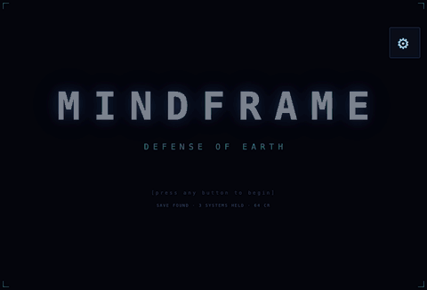

# Mindframe — Defense of Earth

A single-file browser space shooter set in the world of **"Mindframe"** by Oscar Moran.
You are the last human pilot, flying a route of seven systems from Earth to the
Icarus, the enemy battleship. Each system is five waves, and the fifth is a boss.
Clear a system and it is held for good: you can fly it again any time from the map.

**[Play it](index.html)**: no install, no build step, no server. Open `index.html` in any browser.
A Mac app is also available ([download](MindframeGame-app/Mindframe-mac.zip)).

## Controls

| Input | Action |
|---|---|
| `W` `A` `S` `D` | Thrust (momentum + drag) |
| Mouse | Aim |
| Click | Fire (hold to keep firing) |
| `Shift` | Dash *(needs the Dash Drive skill)* |
| `P` | Pause |
| `Esc` | Back one screen; pauses a run |
| `Enter` | Presses the main button on the current screen |

## How a session goes

1. **Home screen.** **LAUNCH**, **SKILL TREE** and **GARAGE**. The live game
   footage behind them is a recording of the real game.
2. **Space map.** The route as a level select, split into three regions
   (Solar System 1, Solar System 2, Icarus). Click a system you have reached
   to select it.
3. **Launching screen.** What you are about to fly: threat, new hostile, boss
   and payout. **ENGAGE** starts it.
4. **The fight.** Five waves. Clearing the fifth shows a result screen and
   returns you to the map.
5. **Dying** loses that attempt at that system, never the campaign.
   **RELAUNCH** goes straight back in.

## The route

| # | System | Hazard | New hostile | Boss |
|---|---|---|---|---|
| 01 | Earth | none | Iteration, Watcher, Primary | Iteration 3296 |
| 02 | Venus | fire vents and dust | Tracker | The Hive Mind |
| 03 | Jupiter | a roaming gravity well | Overseer | Iteration 2117 |
| 04 | Saturn | ring debris down marked lanes | Orbiter | The Architect |
| 05 | Luna | low-gravity zones | Phantom, Meteor, Lander *(new roster)* | The Crescent |
| 06 | Neptune | ice storm fronts and whiteout | Glacier | The Titans (Triton + Proteus) |
| 07 | Icarus | raider beams | Splinter | The Ruler, and what is behind it |

- **Hazards stay with their own system.** Hostiles carry forward within a roster.
  Luna starts a new roster, so Earth's three enemies do not follow you there.
- **Hazards hit enemies too**, five times harder than they hit you. Steering a
  fight into the arena pays off.
- **Earth is a runway.** Waves 1–4 come in softer (62% → 92% of full weight).
  Every other system is at full weight from the first wave.

### Bosses

Every boss fights in **authored attack lines**, three tiers each. At the end
of a line it stops and goes **EXPOSED** (gold ring, ×2 damage, ×4 with
Punishing Pulses). Learning the line is the fight.

Each time a boss climbs a phase the fight freezes for a 2.5-second cutscene
(letterbox, energy pulled in, detonation, the new phase's name). You can fly;
nothing shoots.

When one of a pair (the Titans, the Echo Trial) falls, the other absorbs it in
a 3-second cutscene: the fallen hull breaks into motes that stream into the
survivor while its half of the bar refills.

The climb into a boss's **last** phase gets a scene of its own instead of the
shared one (`SCENES`, keyed `<boss>:<phase>`). The Archive and the thing behind
the Ruler get one for each of their last two phases.

### Wave dials

A `wave:{…}` block on a `SYSTEMS` row toughens waves 1–4 only, never the boss
wave or side missions: hull, damage, fire rate, extra units, arrival spacing,
on-screen cap. Luna and Neptune use it, because by then the pilot is carrying
most of the tree.

## Side missions

Most systems have a yellow side branch on the map. **A side branch only opens
once the system it hangs off is held**, so on a new save Earth is the only
thing that can be clicked.

| System | Side mission | What it is |
|---|---|---|
| Earth | Hazard Run | A gate race against the clock |
| Venus | Hold the Station | Keep a platform alive until the clock runs out, with the vents going |
| Jupiter | Bounty | An elite Tracker that kites and leaves if you are too slow |
| Saturn | Gauntlet | Three Saturn waves back to back; one hit ends it |
| Luna | Echo Trial | Echoes of the Hive Mind and Iteration 2117 together, faster, with less rest. A pair like the Titans: one bar, they take turns, each is shielded at half until the other gets there |

A side mission pays about a third of its system the first time, and a third of
that on every repeat.

### The Quantum Portal

The violet vortex off Jupiter. Behind it are the two hardest fights in the game,
and you pick which one:

- **Iteration 3295**: the Watcher that held the record before 3296.
- **The Archive**: sealed until 3295 is down. Beating it unlocks the
  **Worldbreaker** hull.

## Credits

Credits are the only currency.

| | |
|---|---|
| Holding a wave | 2 CR in Earth, +2 per system after it (Icarus pays 14) |
| Killing a system's boss | 8 CR |
| Side missions and the Portal | a fixed payout, full the first time |

Score is just the scoreboard.

## Skill tree

One tree for the pilot, shared by every hull. Four branches of four tiers.
Each skill costs twice its tier weight in credits.

| Branch | Tier 1 → Tier 4 |
|---|---|
| Damage | Pulse Upgrades → Focused Pulse → Phase Rounds → Punishing Pulses |
| Fire rate | Weapon Overclock → Twin Emitters → Triple Spread → Quantum Spread |
| Hull | Hull Plating → Hull Reinforcement → Repair Field → Biological Weave |
| Movement | Thrust Boost → Dash Drive → Dash Deflector → Interstellar Drive |

Click a skill to read it, then click it again to buy. **RESPEC** refunds every
credit (first click arms it, second click confirms).

## Garage

| Hull | Class | Unlocks |
|---|---|---|
| Lancer | Standard pattern | from the start |
| Bulwark | Assault hull | hold Earth, then 10 CR |
| Needle | Interceptor | hold Venus, then 20 CR |
| Verdict | Siege gunship | hold Jupiter, then 32 CR |
| Worldbreaker | Siege platform | beat The Archive, then 60 CR |

Stat letter grades are calculated from each hull's multipliers in `SHIPS`.

## Powerups

Wrecks drop cells. They drift, get pulled in once you are close, and burn out
after 14 seconds.

| Cell | Effect |
|---|---|
| Hull Repair | +30% hull (only drops below 80%) |
| Overclock | Fire rate nearly doubled for 11s |
| Overcharge | 1.8× damage for 11s |
| Barrier | 6.5s of immunity |
| Scatter | 3-shot spread for 12s |

## Difficulty

Set in **Settings** or the pause menu. Payout is the same at every setting.

| | |
|---|---|
| **Recruit** | About half the incoming damage, softer enemies, stronger aim assist, longer boss rests |
| **Cadet** | The game as tuned. Every multiplier is 1 |
| **Starfarer** | Nearly double damage, no aim assist, bosses lead and improvise between their windows |

**Aim assist**: a round that would narrowly miss bends toward a target ahead of
it (`MAGNET_R`, `MAGNET_CONE`, `MAGNET_TURN`).

## Settings

The gear sits in the same corner of every screen: volume, difficulty,
**Quit Level** (in a run), **Bestiary** (every hostile, boss, cell and control),
**Save Code**, **Read the Story** and **Wipe All Progress**.

- **Save codes** carry your progress between browsers as
  `MF4-<payload>-<checksum>`. Older `MF1`–`MF3` codes still load.
- **Wipe** asks twice.

## Writing the text

All player-facing story text lives in the block marked
`★ WRITE YOUR TEXT HERE ★` at the top of the script in `index.html`:
`SYSTEMS[].brief` / `clear`, `SYS_CLEAR_TEXT` and `LAUNCH_TEXT`. Blank text
skips that screen. Venus through Icarus are still blank.

## Files

| | |
|---|---|
| `index.html` | The whole game: markup, styles, and vanilla-JS `<canvas>` code |
| `MindframeGame-app/` | The Mac app wrapper and `build.sh` |
| `mindframe.gif` | Gameplay capture |
| `mindframe-cover.gif` | Shorter cut under itch.io's 3MB cover limit |

The home-screen footage (`FEED_DATA`) and both GIFs are recorded from the real
game. A bot is driven through the actual `update()` and `draw()`.
